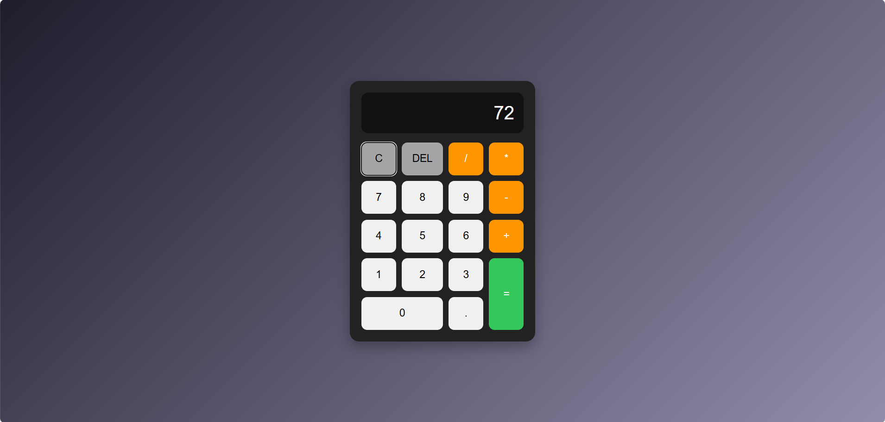

# Calculator App

A simple calculator built with HTML, CSS and JavaScript.

## Features

- Basic arithmetic operations
- Clear all input
- Delete last character
- Prevent invalid operator sequences
- Decimal point validation
- Keyboard support
- Error handling for invalid expressions

## Technologies

- HTML
- CSS
- JavaScript

## Project Goal

This project was created to practice DOM manipulation, event handling, input validation, and building interactive UI logic with JavaScript.

## Screenshot

